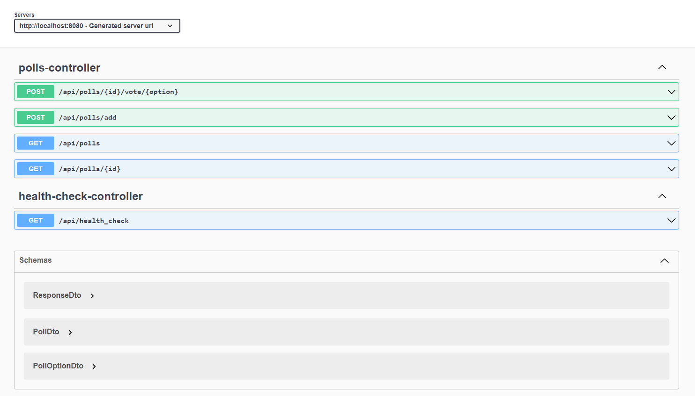
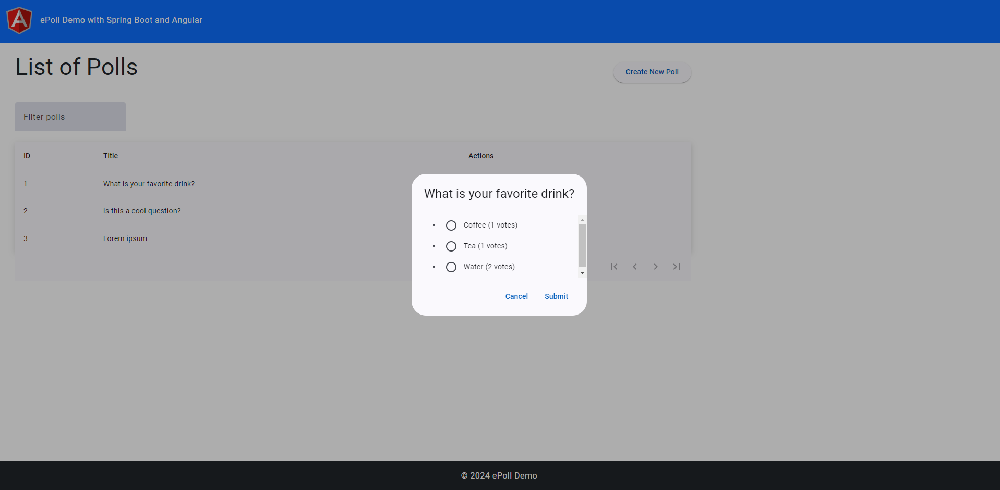
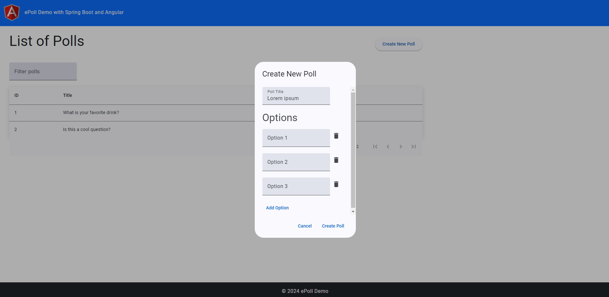

# Demo of Spring Boot application with Angular Material UI

 ## Swagger:


 ## UI:



Easiest way to run:
 - 1. With docker installed from project's root folder run command:
 ```
 docker compose up --build
 ```
 It will create container and images for backend, frontend, postgresql and apply migrations
 - 2. Navigate to http://localhost:8080/api/health_check to check if api is working
 - 3. Navigate to http://localhost:8080/swagger-ui/index.html to check swagger
 - 4. Navigating to http://localhost:4200 to open Angular app

 ## Project structure:
 ```
|   docker-compose.yml
|
+---backend
|   |   .gitignore
|   |   Dockerfile
|   |   mvnw
|   |   mvnw.cmd
|   |   pom.xml
|   |
|   +---.mvn
|   |   \---wrapper
|   |           maven-wrapper.properties
|   |
|   +---src
|      +---main
|      |   +---java
|      |   |   \---com
|      |   |       \---example
|      |   |           \---backend
|      |   |               |   BackendApplication.java
|      |   |               |
|      |   |               +---api
|      |   |               |       HealthCheckController.java
|      |   |               |       PollsController.java
|      |   |               |
|      |   |               +---config
|      |   |               |       RestExceptionHandler.java
|      |   |               |       WebConfig.java
|      |   |               |
|      |   |               +---dtos
|      |   |               |       PollDto.java
|      |   |               |       PollOptionDto.java
|      |   |               |       ResponseDto.java
|      |   |               |
|      |   |               +---entities
|      |   |               |       Poll.java
|      |   |               |       PollOption.java
|      |   |               |       VoteLog.java
|      |   |               |
|      |   |               +---exceptions
|      |   |               |       AppException.java
|      |   |               |
|      |   |               +---mappers
|      |   |               |       PollMapper.java
|      |   |               |       PollOptionMapper.java
|      |   |               |
|      |   |               +---repositories
|      |   |               |       PollOptionRepository.java
|      |   |               |       PollRepository.java
|      |   |               |       VotesLogRepository.java
|      |   |               |
|      |   |               \---services
|      |   |                       PollsOptionsService.java
|      |   |                       PollsService.java
|      |   |
|      |   \---resources
|      |       |   application.properties
|      |       |
|      |       \---db
|      |           \---migration
|      |                   V1__create_polls_table.sql
|      |                   V2__create_polls_options_table.sql
|      |                   V3__insert_initial_polls.sql
|      |                   V4__create_votes_log_table.sql
|      |
|      \---test
|          \---java
|              \---com
|                  \---example
|                      \---backend
|                              BackendApplicationTests.java      
|
\---frontend
    |   .editorconfig
    |   .gitignore
    |   angular.json
    |   Dockerfile
    |   package-lock.json
    |   package.json
    |   README.md
    |   tsconfig.app.json
    |   tsconfig.json
    |   tsconfig.spec.json
    |
    +---.vscode
    |       extensions.json
    |       launch.json
    |       tasks.json
    |
    +---node_modules
    +---public
    |       favicon.ico
    |       logo.png
    |
    \---src
        |   index.html
        |   main.ts
        |   styles.css
        |
        \---app
            |   app.component.css
            |   app.component.html
            |   app.component.spec.ts
            |   app.component.ts
            |   app.config.ts
            |   app.routes.ts
            |
            +---features
            |   +---components
            |   |   +---create-poll-dialog
            |   |   |       create-poll-dialog.component.css
            |   |   |       create-poll-dialog.component.html
            |   |   |       create-poll-dialog.component.spec.ts
            |   |   |       create-poll-dialog.component.ts
            |   |   |
            |   |   +---poll-dialog
            |   |   |       poll-dialog.component.css
            |   |   |       poll-dialog.component.html
            |   |   |       poll-dialog.component.spec.ts
            |   |   |       poll-dialog.component.ts
            |   |   |
            |   |   \---poll-list
            |   |           poll-list.component.css
            |   |           poll-list.component.html
            |   |           poll-list.component.spec.ts
            |   |           poll-list.component.ts
            |   |
            |   \---models
            |           poll.interface.ts
            |           poll.option.interface.ts
            |
            \---shared
                +---components
                |   +---footer
                |   |       footer.component.css
                |   |       footer.component.html
                |   |       footer.component.spec.ts
                |   |       footer.component.ts
                |   |
                |   \---header
                |           header.component.css
                |           header.component.html
                |           header.component.spec.ts
                |           header.component.ts
                |
                +---models
                |       api.resposne.interface.ts
                |
                \---services
                        axios.service.service.spec.ts
                        axios.service.service.ts
 ```                    
